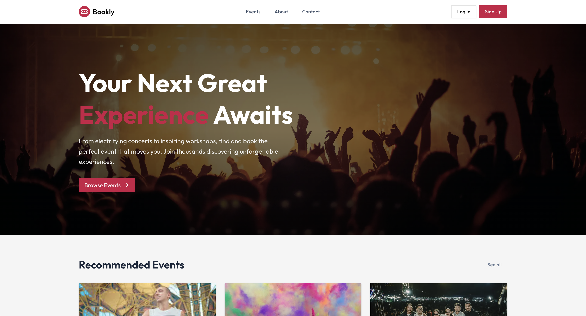
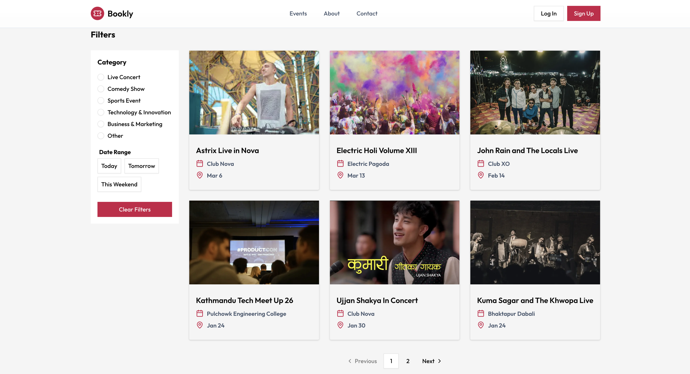
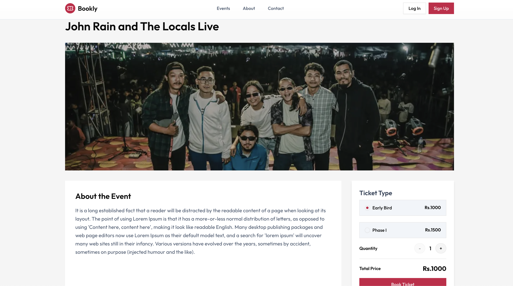
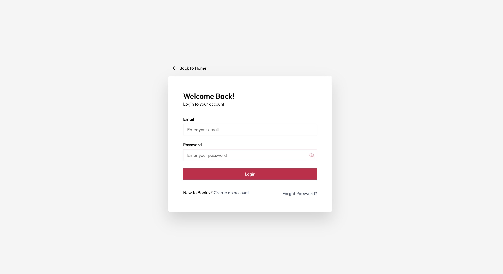
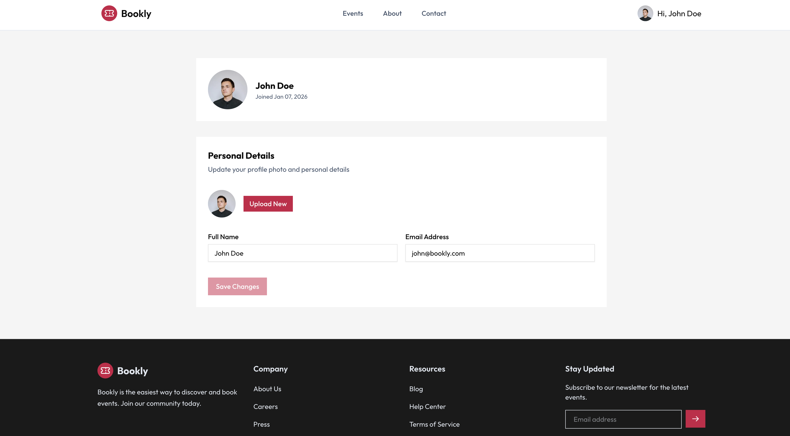

# 🎫 Bookly - Event Booking Platform

A modern, full-stack event booking platform built with Next.js and Express. Bookly allows users to discover events, book tickets, and manage their bookings seamlessly.

🌐 **Live Demo:** [https://bookly-event-listing.vercel.app](https://bookly-event-listing.vercel.app)

---

## ✨ Features

### For Users

- 🔍 **Browse Events** - Discover upcoming events with advanced filtering by category and date
- 🎟️ **Book Tickets** - Select ticket types and quantities with real-time pricing
- 👤 **User Authentication** - Secure signup/login with JWT authentication
- 📱 **Responsive Design** - Optimized for desktop, tablet, and mobile devices
- 💳 **Multiple Payment Options** - Support for eSewa, ConnectIPS, and Visa
- 📋 **Booking Management** - View and manage your event bookings
- 🔐 **Password Reset** - Secure password recovery via email

### For Event Organizers

- ➕ **Create Events** - Rich text editor for event descriptions
- 🖼️ **Image Upload** - Cloudinary integration for event images
- 🎫 **Dynamic Ticket Types** - Create multiple ticket tiers with different pricing
- ✏️ **Edit Events** - Update event details and ticket information
- 📊 **Booking Overview** - Track bookings for your events

---

## 🛠️ Tech Stack

### Frontend

- **Framework:** Next.js 16 (React 19)
- **Styling:** Tailwind CSS 4
- **UI Components:** Radix UI, shadcn/ui
- **Form Handling:** React Hook Form + Zod
- **HTTP Client:** Axios
- **Notifications:** Sonner

### Backend

- **Runtime:** Node.js
- **Framework:** Express.js
- **Database:** MongoDB with Mongoose
- **Authentication:** JWT + httpOnly cookies
- **File Upload:** Multer + Cloudinary
- **Security:** bcryptjs, CORS

---

## 📁 Project Structure

```
bookly/
├── frontend/                 # Next.js frontend application
│   ├── src/
│   │   ├── app/             # App router pages
│   │   ├── components/      # Reusable components
│   │   ├── context/         # React context (Auth)
│   │   └── lib/             # Utilities (axios config)
│   └── package.json
│
└── backend/                 # Express.js backend API
    ├── src/
    │   ├── config/          # Database & Cloudinary config
    │   ├── controllers/     # Route controllers
    │   ├── middleware/      # Auth & upload middleware
    │   ├── models/          # Mongoose models
    │   ├── routes/          # API routes
    │   ├── utils/           # Helper functions
    │   └── server.js        # Entry point
    └── package.json
```

---

## 🚀 Getting Started

### Prerequisites

- Node.js 18+ and npm
- MongoDB database
- Cloudinary account (for image uploads)

### Installation

1. **Clone the repository**

   ```bash
   git clone https://github.com/nabinmhrjn/bookly-event-listing.git
   cd bookly-event-listing
   ```

2. **Setup Backend**

   ```bash
   cd backend
   npm install
   ```

   Create `.env` file:

   ```env
   PORT=8080
   MONGODB_URI=your_mongodb_connection_string
   JWT_SECRET=your_jwt_secret_key
   FRONTEND_URL=http://localhost:3000

   # Cloudinary Configuration
   CLOUDINARY_CLOUD_NAME=your_cloud_name
   CLOUDINARY_API_KEY=your_api_key
   CLOUDINARY_API_SECRET=your_api_secret
   ```

   Start the backend:

   ```bash
   npm run dev
   ```

3. **Setup Frontend**

   ```bash
   cd frontend
   npm install
   ```

   Create `.env.local` file:

   ```env
   NEXT_PUBLIC_API_URL=http://localhost:8080/api
   ```

   Start the frontend:

   ```bash
   npm run dev
   ```

4. **Access the application**
   - Frontend: http://localhost:3000
   - Backend API: http://localhost:8080

---

## 🔑 API Endpoints

### Authentication

- `POST /api/users/signup` - Register new user
- `POST /api/users/login` - Login user
- `POST /api/users/logout` - Logout user
- `POST /api/users/forgot-password` - Request password reset
- `POST /api/users/reset-password` - Reset password

### Events

- `GET /api/events` - Get all events (with pagination & filters)
- `GET /api/events/:id` - Get event by ID
- `POST /api/events` - Create new event (auth required)
- `PUT /api/events/:id` - Update event (auth required)
- `DELETE /api/events/:id` - Delete event (auth required)

### Bookings

- `GET /api/bookings` - Get user's bookings (auth required)
- `GET /api/bookings/:id` - Get booking by ID (auth required)
- `POST /api/bookings` - Create new booking (auth required)
- `PUT /api/bookings/:id/cancel` - Cancel booking (auth required)

### Users

- `GET /api/users/:id` - Get user profile
- `PUT /api/users/:id` - Update user profile (auth required)

---

## 🌐 Deployment

### Frontend (Vercel)

1. Push code to GitHub
2. Import project in Vercel
3. Add environment variables:
   - `NEXT_PUBLIC_API_URL=https://your-backend-url.com/api`
4. Deploy

### Backend (Render)

1. Push code to GitHub
2. Create new Web Service in Render
3. Add environment variables (same as `.env`)
4. Deploy

---

## 🔒 Security Features

- JWT authentication with httpOnly cookies
- Password hashing with bcryptjs
- CORS configuration for cross-origin requests
- Input validation with Zod
- Secure file upload with Cloudinary
- Protected API routes with authentication middleware

---

## 📸 Screenshots

### Homepage



### Events Listing



### Event Detail



### Checkout


### Login



### Profile



---

## 🤝 Contributing

Contributions are welcome! Please feel free to submit a Pull Request.

1. Fork the project
2. Create your feature branch (`git checkout -b feature/AmazingFeature`)
3. Commit your changes (`git commit -m 'Add some AmazingFeature'`)
4. Push to the branch (`git push origin feature/AmazingFeature`)
5. Open a Pull Request

---

## 📝 License

This project is open source and available under the [MIT License](LICENSE).

---

## 👨‍💻 Author

**Nabin Maharjan**

- GitHub: [@nabinmhrjn](https://github.com/nabinmhrjn)

---

## 🙏 Acknowledgments

- [Next.js](https://nextjs.org/) - React framework
- [Tailwind CSS](https://tailwindcss.com/) - CSS framework
- [Radix UI](https://www.radix-ui.com/) - UI components
- [Cloudinary](https://cloudinary.com/) - Image hosting
- [MongoDB](https://www.mongodb.com/) - Database

---

**Made with ❤️ by Nabin Maharjan**
